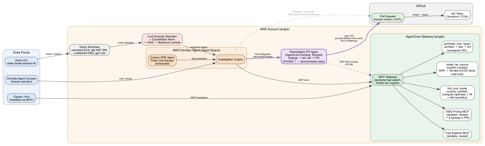

# AI Cost-Optimization Platform with AWS DevOps Agent

> **Draft spec / working design** — target: an `aws-samples`-style blueprint.
> Status: architecture agreed, implementation not started.

A single-account, ready-to-deploy blueprint where **AWS DevOps Agent** autonomously finds cost waste and remediates it via **GitHub Pull Requests** — usable *today*, before DevOps Agent's native PR capability matures, and cleanly upgradeable when it does.



---

## The core idea: a decommissionable A2A bridge

AWS DevOps Agent (June 2026 release) supports **bring-your-own sub-agents via A2A**, **scheduled custom SRE agents**, and **headless MCP/A2A access**. It does not yet open Pull Requests natively.

This sample bridges that gap with a pattern we call the **decommissionable A2A bridge**:

| Phase | Investigation | Remediation |
|-------|--------------|-------------|
| **Phase 1 (today)** | AWS DevOps Agent | Custom **Remediation-PR Agent** (AgentCore Runtime), connected as an **A2A sub-agent** of DevOps Agent. Generates IaC diffs, opens GitHub PRs. |
| **Phase 2 (later)** | AWS DevOps Agent | DevOps Agent native PR support. **Deregister one A2A connection — done.** Zero re-architecture. |

Customers can adopt autonomous cost remediation **now** and delegate to DevOps Agent **later** — the upgrade is a config change, not a rebuild.

### Design principle

> **Gateway is for tools. DevOps Agent is for judgment.**

Dumb capabilities (Cost Explorer queries, report generation, GitHub reads) live behind a single AgentCore Gateway. The reasoning loop — what to investigate, what to recommend, when to delegate — stays in DevOps Agent. Every client (agents *and* humans) is just a consumer of the same Gateway.

---

## Architecture

### Components

**AWS DevOps Agent (Agent Space) — the brain**
- **Scheduled custom SRE agent** — "Daily Cost Sweep": checks for idle NAT gateways, unattached EBS volumes, gp2 volumes, oversized instances
- **Event-driven path** — Cost Anomaly Detection / CloudWatch alarm → SNS → HMAC-signed webhook → investigation (same pattern as the [DevOps Agent interactive demo](https://github.com/aws-samples/sample-aws-devops-agent-interactive-demo))
- Investigation engine uses Gateway MCP tools for evidence gathering

**AgentCore Gateway (single) — the toolbox**

Target selection criteria: (a) not already native to DevOps Agent, (b) needed by multiple clients, (c) safe to expose to *every* Gateway client.

| MCP target | Type | Purpose |
|---|---|---|
| Cost Explorer MCP | **awslabs, reused** | Spend data, anomalies, forecasts |
| AWS Pricing MCP | **awslabs, reused** | Price lookups so PRs state *"saves ~$47/month"* — recommendations without dollar amounts don't get merged |
| `find_cost_waste` | custom Lambda | One purposeful tool wrapping Compute Optimizer + Trusted Advisor cost checks + idle-resource heuristics (NAT GW bytes, unattached EBS, gp2 inventory). Curated tools beat raw API mirrors for LLM tool selection |
| `locate_iac_source` | custom Lambda | The real job isn't "read GitHub" — it's **resource ARN → owning Terraform/CDK block** (tags + Resource Explorer + scoped read-only repo search). Hardest problem in the sample, promoted to a first-class tool |
| `generate_cost_report` | custom Lambda | xlsx (openpyxl) → S3 → presigned URL. Available to **every** client: DevOps Agent attaches it to investigations, Claude/Kiro fetch it from the IDE, scheduled agents can mail it weekly |
| *(optional)* DevOps Agent MCP endpoint | passthrough | `start_investigation` / `get_investigation_status` for the single-endpoint IDE story (entry-point Option 2) |

**Deliberately NOT behind the Gateway:**
- **CloudWatch / CloudTrail / logs MCPs** — DevOps Agent investigates with these natively; duplicating them adds cost and tool-selection confusion for zero new capability
- **GitHub write access** — write credentials on a shared Gateway would let any connected IDE client silently open PRs. Write stays a *private* capability of the Remediation-PR Agent (own runtime, own secret). Least privilege by architecture; Gateway exposes read-only `locate_iac_source` instead

**Remediation-PR Agent (Phase 1, decommission later)**
- AgentCore Runtime (Strands), registered as A2A sub-agent of DevOps Agent
- Receives structured finding → locates owning Terraform/CDK block → generates diff → runs **`cdk validate`** (CloudFormation pre-deployment validation) on its own branch → opens the GitHub PR
- **Human-in-the-loop for free**: PR review + merge *is* the approval gate

**Demo workload + break/fix CLI**
- Canned cost-waste scenarios: oversized EC2, idle NAT Gateway, unattached EBS, gp2→gp3
- `make break-scenario-N` / `make restore` — deliberately CLI instead of a web dashboard (fits the DevOps audience, keeps the sample small)

### Three entry points, one backend

1. **DevOps Agent console** (primary UX) — investigations, timelines, Agent Spaces, dashboards. No custom frontend to build or maintain.
2. **Kiro / Claude via headless MCP** — two documented wiring options:
   - **Option 1 (simplest):** IDE connects to *both* the Gateway (tools) and DevOps Agent's own headless MCP endpoint (judgment) — e.g. the Kiro power for AWS DevOps Agent.
   - **Option 2 (single endpoint):** register DevOps Agent's MCP endpoint as one more Gateway target (`start_investigation`, `get_investigation_status`) so the Gateway is the only connection the IDE needs. The *client's* LLM decides when to offload to DevOps Agent.
3. **Demo CLI** — break/restore scenarios for a 15-minute live demo.

> ⚠️ Note: Kiro/Claude → Gateway alone gets raw tools only — no DevOps Agent judgment. That's why the two options above exist; without them the IDE's own model does the analysis.

### Demo script (15 min)

```
make break-scenario-2        # e.g. spin up idle NAT GW
# → CloudWatch alarm fires → webhook → DevOps Agent investigates
# → finding delegated via A2A → Remediation-PR Agent
# → PR appears in GitHub with IaC diff + cdk validate report
# → human reviews & merges → fixed
# Bonus: ask Kiro/Claude for "this month's cost report" → xlsx via presigned URL
```

---

## Deployability: ~95% single `cdk deploy`

CloudFormation now has first-class DevOps Agent resources ([`AWS::DevOpsAgent::*`](https://docs.aws.amazon.com/AWSCloudFormation/latest/TemplateReference/AWS_DevOpsAgent.html)):

| Piece | IaC status |
|---|---|
| Agent Space | ✅ `AWS::DevOpsAgent::AgentSpace` |
| Account association | ✅ `AWS::DevOpsAgent::Association` |
| **Gateway registered as MCP server in DevOps Agent** | ✅ `AWS::DevOpsAgent::Service` (`ServiceType: mcpserver` / `mcpserversigv4` — the sigv4 variant may avoid the Cognito OAuth dance entirely) |
| AgentCore Gateway + targets, Runtime, Cognito, workload, alarms, webhook Lambda | ✅ CDK (`AWS::BedrockAgentCore::*` + standard resources) |
| Webhook URL + HMAC secret | ⚠️ post-deploy step (custom-resource candidate if API exists) |
| A2A sub-agent registration | ⚠️ post-deploy step (newest feature; custom-resource candidate) |
| Scheduled SRE agent definition | ⚠️ verify — "Git-managed skills" may allow repo-defined |
| GitHub credentials | ✅ Secrets Manager (seeded by script) |

**Known CFN limit (from AWS docs):** OAuth-flow services (GitHub, Slack, Datadog) **cannot** be registered with DevOps Agent via `AWS::DevOpsAgent::Service` — console-only. **This design sidesteps that entirely**: GitHub access goes through our own Gateway MCP target using Secrets Manager credentials, not DevOps Agent's native GitHub integration. Fully IaC-deployable GitHub connectivity is a deliberate design benefit.

---

## Design decisions & rationale

| Decision | Alternatives considered | Why |
|---|---|---|
| DevOps Agent as orchestrator (console = primary UX) | Custom frontend + Gateway fronting everything (Thomson Reuters pattern); putting DevOps Agent *behind* the Gateway | A custom frontend demotes DevOps Agent to just-another-tool and forces you to rebuild Agent Spaces, timelines, dashboards, incident-skip, memories. TR's pattern fits a multi-team enterprise hub, not a single-account sample. It also muddies the decommission story — the sample only reads cleanly if DevOps Agent is the brain. |
| A2A sub-agent for PR work (not EventBridge handoff) | Structured recommendation events on EventBridge | A2A makes decommissioning literally "remove one connection". EventBridge handoff would still work but is a weaker upgrade story. |
| Excel reporting as a Gateway MCP tool | Client-side generation in Claude cowork | Behind the Gateway, *every* client gets it (scheduled agents included); client-side means reports only exist when a human with Claude asks. |
| Curated MCP tools (`find_cost_waste`, `locate_iac_source`) over raw API mirrors | One MCP target per AWS API (Compute Optimizer, Trusted Advisor, GitHub…) | Fewer, purposeful tools improve LLM tool selection; reusing awslabs MCP servers (Cost Explorer, Pricing) shows composition over reinvention. |
| GitHub write creds private to PR agent | GitHub read/write MCP on the shared Gateway | Anyone connected to the Gateway could open PRs. Read-only IaC lookup is shared; the write path is isolated with its own secret. |
| CLI break/fix instead of web dashboard | Interactive dashboard like the networking demo | Less code to maintain, fits DevOps audience, keeps focus on the agent pattern rather than UI. |

## Prior art / references

- [Thomson Reuters Agentic Platform Engineering Hub (AgentCore)](https://aws.amazon.com/blogs/machine-learning/how-thomson-reuters-built-an-agentic-platform-engineering-hub-with-amazon-bedrock-agentcore/) — multi-team enterprise hub pattern
- [aws-samples/sample-aws-devops-agent-interactive-demo](https://github.com/aws-samples/sample-aws-devops-agent-interactive-demo) — break/fix demo pattern, webhook wiring, CDK stack layout
- [AWS DevOps Agent: custom SRE agents, BYO sub-agents, MCP/A2A (June 2026)](https://aws.amazon.com/about-aws/whats-new/2026/06/aws-devops-agent-custom-agents/)
- [`AWS::DevOpsAgent::*` CloudFormation reference](https://docs.aws.amazon.com/AWSCloudFormation/latest/TemplateReference/AWS_DevOpsAgent.html)
- [CloudFormation/CDK pre-deployment validation (`cdk validate`)](https://aws.amazon.com/blogs/devops/ship-infrastructure-faster-with-cloudformation-and-cdk-pre-deployment-validation-on-every-stack-operation/)

## Open items

- [ ] Verify A2A delegation payload supports full finding context (resource ARNs, repo hints) or define a thin structured contract
- [ ] Check APIs for webhook/HMAC + A2A registration → wrap as CFN custom resources if possible
- [ ] Verify scheduled SRE agent can be defined via Git-managed skills
- [ ] Confirm exact scope of DevOps Agent native PR capability (which finding types) — affects Phase 2 timeline
- [ ] Redraw diagram with official AWS architecture icons for the final sample
- [ ] Repo structure + CDK stack breakdown
- [ ] Constrain Phase 1 IaC mapping to a known repo structure with tagged resources

## Repo contents (current)

```
architecture.dot   # graphviz source
architecture.png   # rendered diagram
README.md          # this spec
```
